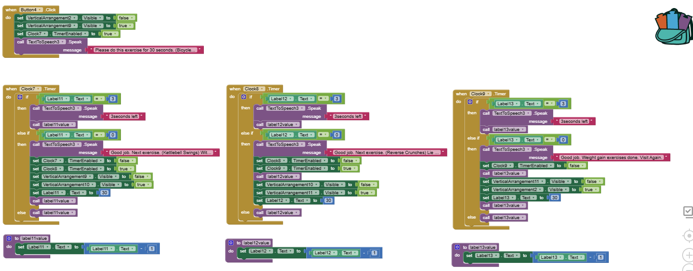

# MIT App Inventor Project

<!--
*** README.md Reference: https://github.com/othneildrew/Best-README-Template/tree/master
-->

<!-- PROJECT LOGO -->

   <h3>Fitness Exercise App</h3> 
 A simple fitness exercise app built using MIT App Inventor. 
 

<!-- ABOUT THE PROJECT -->

## About The Project

The Fitness Exercise App is a mobile application designed for individuals who want to stay active and fit through structured exercise routines. It provides a guided workout experience with visual demonstrations, audio instructions and countdown timers to keep users engaged and motivated.

The app is built using MIT App Inventor, incorporating Text-to-Speech (TTS) for verbal workout instructions, visual exercise demonstrations, and a 30-second countdown timer to help users stay on track. Users can choose from three exercise categories, allowing them to customize their fitness routine based on their personal goals.

This project was developed with the goal of creating a simple yet effective fitness assistant, removing the need for printed workout guides or external trainers. By integrating audio, images and timers, this app ensures that users get a seamless exercise experience.

(<a href="#readme-top">back to top</a>)

<!-- KEY FEATURES -->

## Key Features
### Voice-Guided Workouts
- The app integrates Text-To-Speech (TTS) to provide verbal exercise instructions.
- Users can listen to instructions while focusing on the workout.

### Step-by-Step Exercise Demonstrations
- Each workout category includes high-quality images to guide users.
- Helps in understanding exercise form and technique.

### 30-Second Countdown Timer
- A built-in timer runs 30 seconds per exercise.
- Notifies the user when the time is up.

### User-Friendly Interface
- Simple layout designed for ease of use.
- Large buttons & clear navigation make the app accessible for all users.

### Workout Categories
Users can choose from three different fitness categories:
1. **Core Burner** – Focused on core and abdominal exercises.
2. **Weight Loss** – Includes cardio-based fat-burning exercises.
3. **Weight Gain** – Designed for muscle-building and strength training.

Each category has a dedicated screen where users can view the exercise details and start their workout.

(<a href="#readme-top">back to top</a>)

<!-- APP SCREEN AND UI DESIGN -->

## App Screens and UI Design

### **1️⃣ Home Screen**
- Serves as the main navigation hub.
- Users can select a workout category.
- Features a clean and structured layout.

---
### 2️⃣ Exercise Category Screen
- Users choose between Core Burner, Weight Loss, or Weight Gain exercises.
- Large, easy-to-press category buttons.
- Displays preview images of exercises.

---
### 3️⃣ Workout Screens
- Displays selected exercises.
- Features step-by-step image guidance.
- Provides audio instructions via Text-To-Speech.
- Runs a 30-second countdown timer.
- Shows a completion message at the end of the workout.

(<a href="#readme-top">back to top</a>)

<!-- CORE COMPONENT USED -->

## Core Components Used

### UI Components (Designer View)  
These are the visible components that make up the user interface of the Fitness Exercise App.

| **Component**              | **Name(s)**                             | **Purpose** |
|---------------------------|----------------------------------------|------------|
| **Screen**               | `Screen1`                               | The **main app screen** where all interactions occur. |
| **Labels**               | `Label1 - Label13`                      | Display **exercise instructions, countdown timers, and status messages**. |
| **Buttons**              | `Button1 - Button4`                     | Allow users to **navigate between screens** and **select exercises**. |
| **Images**               | `Image1 - Image9`                       | Provide **visual demonstrations** of exercises. |
| **TextBoxes**            | `TextBox2 - TextBox11`                  | Allow **users to input information** under images. |
| **Vertical Arrangements** | `VerticalArrangement1 - VerticalArrangement11` | **Organize UI elements** into structured sections. |

---

### **🔧 Non-Visible Components (Blocks)**  
These components are **not directly visible** but handle the app's logic and **functionalities**.

| **Component**               | **Name(s)**                           | **Purpose** |
|-----------------------------|--------------------------------------|------------|
| **Clock (9 Instances)**      | `Clock1 - Clock9`                    | **Handles countdown timers** for exercises. |
| **Text-To-Speech (3 Instances)** | `TextToSpeech1 - TextToSpeech3` | **Guides users through workouts** using voice instructions. |

---

(<a href="#readme-top">back to top</a>)

<!-- CODE BLOCK SNAPSHOT -->

## **Code Block Snapshots**
### **1️⃣ Workout Selection Logic**
This MIT App Inventor block code ensures that users can select an exercise and navigate to the correct screen.

#### **Code Block Screenshot:**

---

### **2️⃣ Core Burn Exercise Timer & Completion Logic**
This block controls the **Core Burn workout timer**, ensuring that:
- The exercise starts when selected.
- Starts a countdown timer for the exercise.
- The Text-To-Speech provides instructions.
- Provides alert before 3 seconds left
- A completion message appears after the timer finishes.
- Automatically switches to the next exercise after completion.
- After the completion of last exercise of Core Burn it returns to the landing page.

#### **Code Block Screenshot:**

### **3️⃣ weight Loss Exercise Timer & Completion Logic**
- The exercise starts when selected.
- Announces progress via voice prompts.
- A completion message appears after the timer finishes.
- Transitions to the next step smoothly.
- After the completion of last exercise of Weight Loss it returns to the landing page.

#### **Code Block Screenshot:**

### **4️⃣ weight gain Exercise Timer & Completion Logic**
- Users can start the Weight Gain workout.
- The countdown begins as soon as the workout starts.
- Text-To-Speech guidance is given for the duration of the workout.
- The user is notified upon completion.
- After the completion of last exercise of Weight Gain it returns to the landing page.

#### **Code Block Screenshot:**

(<a href="#readme-top">back to top</a>)

<!-- DEVELOPMENT PROCESS -->

## **Development Process**
### **Challenges & Solutions**
1. **Ensuring UI Simplicity & Readability**  
   - Used Vertical Arrangements for a structured layout.
   - Ensured buttons and text were large and readable.

2. **Synchronizing Timer & Text-To-Speech**  
   - Initially, Text-To-Speech finished before the timer.
   - Solution: Adjusted timing logic to ensure proper synchronization.

3. **Debugging Issues with Clock Component**  
   - Faced bugs where timers overlapped.
   - Fixed by handling each timer separately.

<!-- PLANNED FUTURE ENHANCEMENT -->

### **Planned Future Enhancements**
- **Workout Progress Tracking** – Store exercise completion counts in **TinyDB**.
- **Custom Workout Durations** – Allow users to **set their own workout durations**.
- **More Exercise Categories** – Expand beyond the **three main categories**.

(<a href="#readme-top">back to top</a>)

<!-- CODE REVIEW AND IMPROVEMENTS -->

## **Code Review & Improvements**
1. **Refactoring & DRY Principles**  
   - Removed duplicate code for exercise selection.
   - Used procedures and variables for cleaner logic.

2. **UI Improvements**  
   - Optimized button placements and screen transitions.

3. **Bug Fixes & Error Handling**  
   - Fixed countdown timer bugs.
   - Resolved UI visibility issues for smooth navigation.

<!-- GITHUB REPOSITORY -->

## **Acknowledgments**
This project was inspired by fitness training principles and uses MIT App Inventor features for a **seamless workout experience**.

- **[MIT App Inventor](https://appinventor.mit.edu/)** - The primary tool for developing the app.
- **[Text-to-Speech API](https://cloud.google.com/text-to-speech/)** - Used for voice-guided workouts.
- **[YouTube Fitness Workouts](https://youtu.be/OEEm7RFv_wQ?si=mi1ZLDB7RXdpfhwX)** - Referenced for exercise descriptions.

(<a href="#readme-top">back to top</a>)

